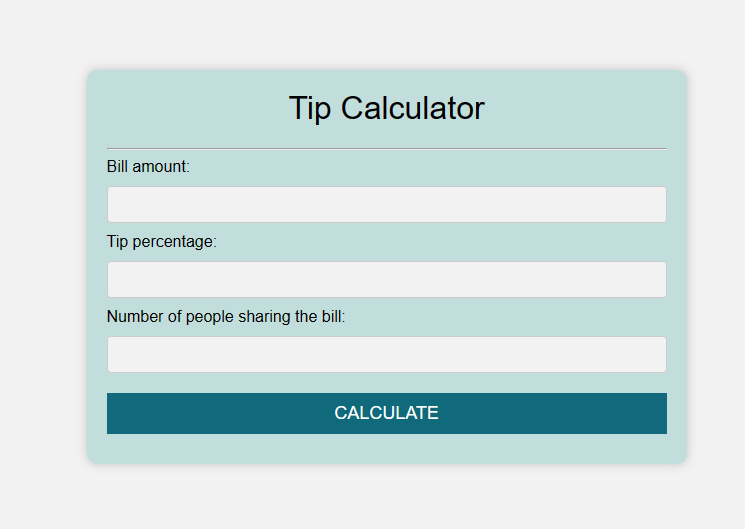
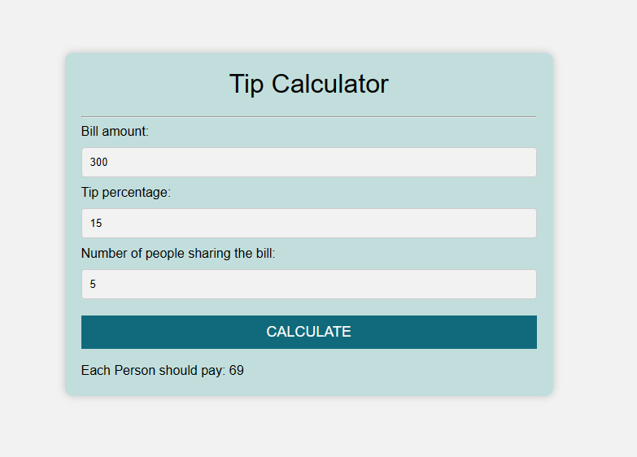

# Tip-calculator

 ## Description
 Tip Calculator is a JavaScript project, that allows the user to do a tip claculation.
 Using HTML we are giving desired structure, option for the input, and submit button. With the help of CSS, we are beautifying our structure by giving colors and desired font, etc.
 In the JavaScript section, we are processing the taken input and after calculating, the respective output is printed.

## Usage

 Enter bill amount and the percentage of service charge and the number of people sharing the bill.

 ##
 
 
 
